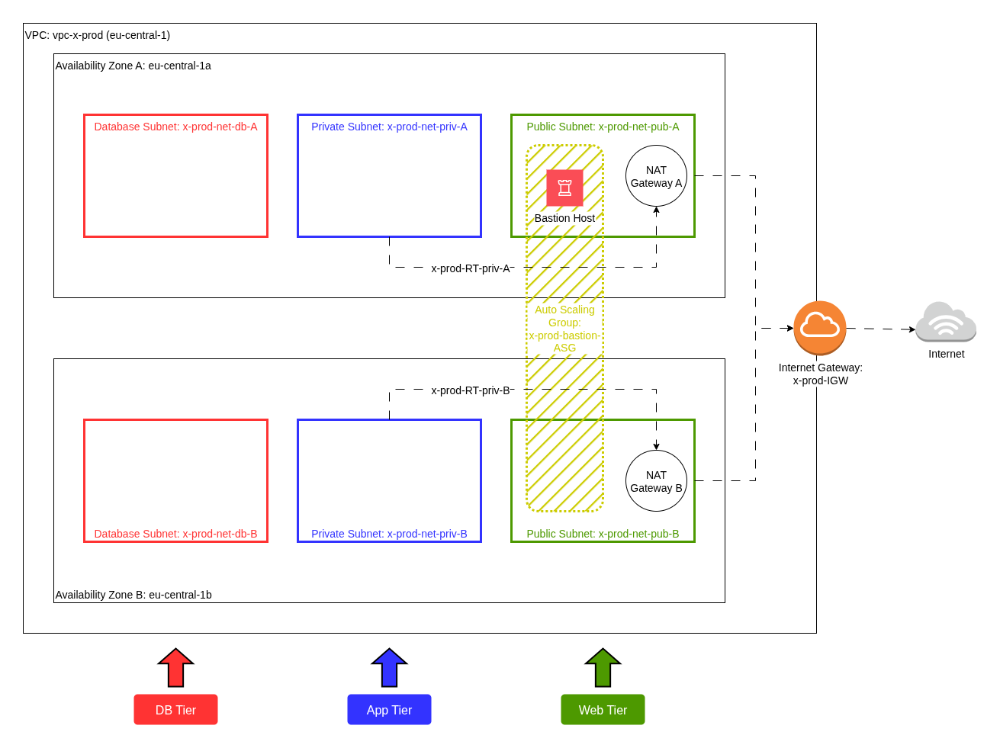

# AWS install 3-Layer Architecture with Terraform

 <br>

### Create AWS access keys (manually)

1. IAM -> User groups -> create group "testgroup" with policies
    * AmazonEC2FullAccess - temporary
2. IAM -> Users -> create user "testuser"
    * not 'Provide user access to the AWS Management Console'
    * add to just created "testgroup"
3. open new user page -> `Create access key` -> Command Line Interface (CLI)
4. prepare aws CLI config
    * chmod 600 aws/*
    * `cp ./aws/* ~/.aws/`
    * edit (access key ID, secret access key, region, output format)


### Prepare AWS CLI (on debian)

open AWS web console and create access keys

```
git clone <this repo>
cd IaC/aws-N-layer                          # enter working directory
---
python3 -m venv venv                        # # # create Python virtual env (only on first launch)
. venv/bin/activate                         # enter to the python virtual env
python3 -m pip install --upgrade pip        # # # upgrade pip (only on first launch)
pip install -r requirements.txt             # # # install project requirements (only on first launch)
```

configure AWS CLI with `aws configure` using your access keys


### Download and install Terraform via APT Package manager (official ppa repo)
```
# install dependencies
sudo apt update
sudo apt install gnupg software-properties-common

# download (wget) and install (gpg --dearmor | tee) HashiCorp GPG key
wget -O- https://apt.releases.hashicorp.com/gpg | \
    gpg --dearmor | \
    sudo tee /usr/share/keyrings/hashicorp-archive-keyring.gpg > /dev/null

# Verify the GPG key fingerprint
gpg --no-default-keyring \
    --keyring /usr/share/keyrings/hashicorp-archive-keyring.gpg \
    --fingerprint

# Add the official HashiCorp repository to your system
echo "deb [arch=$(dpkg --print-architecture) signed-by=/usr/share/keyrings/hashicorp-archive-keyring.gpg] https://apt.releases.hashicorp.com $(grep -oP '(?<=UBUNTU_CODENAME=).*' /etc/os-release || lsb_release -cs) main" | sudo tee /etc/apt/sources.list.d/hashicorp.list

# finally Install Terraform from the new PPA repository
sudo apt update
sudo apt install terraform

# run it only once
terraform init

# prepare key for Launch Template (Auto Scaling Group for Bastion Host)
ssh-keygen -t rsa -b 4096 -f ~/.ssh/my-key
```

### Apply terraform file for main goal

```
terraform plan
terraform apply
```

This will took about 10 minutes <br>
And 2 test servers will be created: <br>
* EC2-priv-A (Subnet: x-prod-net-priv-A
* EC2-db-B (Subnet: x-prod-net-db-B)
both with security group 'x-prod-bastion-ssh-SG' and key pair 'x-prod-bastion-key'


### Let's test it

* connect to our instances
    * bastion (Public) - copy Public IPv4
        * ssh -i ~/.ssh/my-key ec2-user@3.89.62.120
        * ping 8.8.8.8 # ping OK
        * touch key.pem
        * chmod 600 key.pem
        * insert the content of priv key ~/.ssh/my-key
    * Private (enter from bastion) - copy Private IPv4
        * ssh -i ~/key.pem ec2-user@10.0.12.243
        * ping 8.8.8.8 # ping OK
    * DB (enter from bastion) - copy Private IPv4
        * ssh -i ~/key.pem ec2-user@10.0.23.144
        * ping 8.8.8.8 # ping NOT OK

Feel free to create your Auto Scaling Groups in all tiers and to run as many EC2 instances as you need for your tasks

